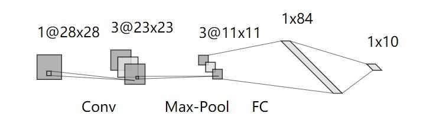
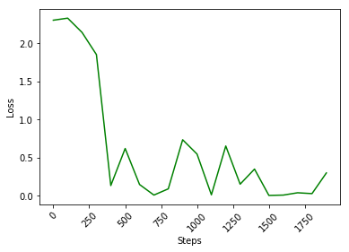
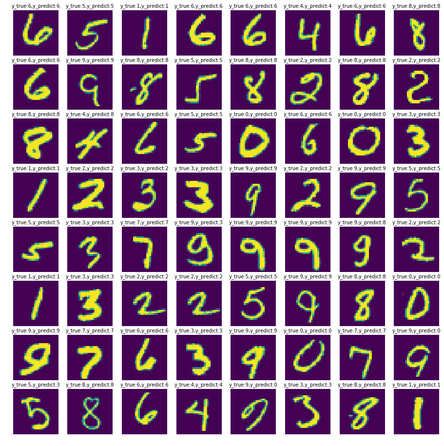

# 基于Numpy实现CNN

###### 2019.07.29

## 前言

本文是基于numpy实现CNN的设计，并在经典的手写数字Mnist数据集上进行测试，最终获得92.82%的测试精度。

根据最初的设计要求，需要设计一个三层的网络（我的理解是不包括输入和输出层），基于LeNet-5的相关参数，我设计了如下的网络结构：

|   网络名   |  输入   | filter | stride | padding |  输出   |
| :--------: | :-----: | :----: | :----: | :-----: | :-----: |
|   Input    | 28x28x1 |        |        |         | 28x28x1 |
|   Conv1    | 28x28x1 | 5x5x3  |  1x1   |   0x0   | 23x23x3 |
| Maxpooling | 23x23x3 |  3x3   |  2x2   |   0x0   | 11x11x3 |
|   FullC    | 11x11x3 |        |        |         |   84    |
|   Output   |   84    |        |        |         |   10    |

其计算流图如下：



训练过程中，我设置batch_size=4，迭代次数设置成2000，基于Numpy设计出来的网络，训练较慢，训练时间大概20min左右。

## 设计思路

### 1.卷积层

- #### 前向传播：

$$
\begin{align}
&z^l_{d,i,j} = \sum_{c=1}^{C^{l-1}}\sum_{m=0}^{k_1^{l-1}-1} \sum_{n=0}^{k_2^{l-1}-1} W_{m,n,c,d}^{l-1} z_{c,i \cdot s_1^{l-1}+m,j \cdot s_2^{l-1}+n}^{l-1} + b^{l-1}_d  & i \in [0,H^l-1], j\in [0,\hat W^l-1]\
\end{align}
$$

前向传播即是权重和输出乘积加上偏置对通道数，核的大小求和。

```python
def convolution_forward(X_input, Kernel, b, padding=(0, 0), strides=(1, 1)):
    """
    多通道卷积前向过程
    :param X: 卷积层矩阵,形状(N,C,H,W)，N为batch_size，C为通道数
    :param Kernel: 卷积核,形状(C,D,k1,k2), C为输入通道数，D为输出通道数
    :param b: 偏置,形状(D,)
    :param padding: padding
    :param strides: 步长
    :return: 卷积结果
    """
    padding_X = np.lib.pad(X_input, ((0, 0), (0, 0), (padding[0], padding[0]), (padding[1], padding[1])), 'constant',
                           constant_values=0)
    N, _, height, width = padding_X.shape
    C, D, k1, k2 = Kernel.shape

    ##简单设计，防止出现不能整除情况，可用floor函数避免
    h_ = (height - k1) % strides[0]
    w_ = (width - k2) % strides[1]

    ##设计简单，不为整数报错
    if not h_.is_integer() or not w_.is_integer():
        raise Exception('Invalid output dimension!')

    ##强制整除
    ##卷积之后的长度，padding为0
    H_ = 1 + (height - k1) // strides[0]
    W_ = 1 + (width - k2) // strides[1]
    conv_X = np.zeros((N, D, H_, W_))

    ##求和操作
    for n in np.arange(N):
        for d in np.arange(D):
            for h in np.arange(height - k1 + 1):
                for w in np.arange(width - k2 + 1):
                    conv_X[n, d, h, w] = np.sum(padding_X[n, :, h:h + k1, w:w + k2] * Kernel[:, d]) + b[d]
    return conv_X
```

- #### 反向传播：

$$
\begin{align}
&\frac {\partial L} {\partial W_{m,n,c,d}^{l-1}} 
= \sum_i \sum_j \frac {\partial L} {\partial z^l_{d,i,j}} * \frac {\partial z^l_{d,i,j}} {\partial W_{m,n,c,d}^{l-1}}\\
&=\sum_i \sum_j \delta^l_{d,i,j} * \frac {\partial ( \sum_{c=1}^{C^{l-1}}\sum_{m=0}^{k_1^{l-1}-1} \sum_{n=0}^{k_2^{l-1}-1} W_{m,n,c,d}^{l-1} z_{c,i \cdot s_1^{l-1}+m,j \cdot s_2^{l-1}+n}^{l-1} + b^{l-1}_d  )} {\partial W^{l-1}_{m,n,c,d}}  \\
&=\sum_i \sum_j \delta^l_{d,i,j} * z_{c,i \cdot s_1^{l-1}+m,j \cdot s_2^{l-1}+n}^{l-1} \
\end{align}
$$

$$
\begin{align}
\frac {\partial L} {\partial b^{l-1}_d} =\sum_i \sum_j \delta^l_{d,i,j} 
\end{align}
$$

损失函数关于第L-1层权重的梯度为损失函数关于L层梯度在卷积核在Z（L-1）上做卷积的结果。另外我们还需定义两个内部函数,一个是在反向中对于步长大于1的卷积核,对输出层梯度行列(高度和宽宽)之间插入零;另一个是对于padding不为零的卷积核，在对输入层求梯度后，剔除padding。在自定义库CNN中，我们定义了_Zeros_padding（）函数，实现每个行列之间增加指定的个数的零填充；_定义Zeros_remove（）函数实现移除padding。

```python
def convolution_backward(next_dX, Kernel, X, padding=(0, 0), strides=(1, 1)):
    """
    多通道卷积层的反向过程
    :param next_dX: 卷积输出层的梯度,(N,D,H',W'),H',W'为卷积输出层的高度和宽度
    :param Kernel: 当前层卷积核，(C,D,k1,k2)
    :param X: 卷积层矩阵,形状(N,C,H,W)，N为batch_size，C为通道数
    :param padding: padding
    :param strides: 步长
    :return:
    """
    N, C, H, W = X.shape
    C, D, k1, k2 = Kernel.shape

    # 卷积核梯度
    padding_next_dX = Zeros_padding(next_dX, strides)
    # 增加高度和宽度0填充
    ppadding_next_dX = np.lib.pad(padding_next_dX, ((0, 0), (0, 0), (k1 - 1, k1 - 1), (k2 - 1, k2 - 1)), 'constant',
                                  constant_values=0)

    #旋转180度
    # 卷积核高度和宽度翻转180度
    flip_K = np.flip(Kernel, (2, 3))
    # 交换C,D为D,C；D变为输入通道数了，C变为输出通道数了
    switch_flip_K = np.swapaxes(flip_K, 0, 1)

    ##rot(180)*W
    dX = convolution_forward(ppadding_next_dX.astype(np.float64), switch_flip_K.astype(np.float64), np.zeros((C,), dtype=np.float64))

    # 求卷积核的梯度dK
    swap_W = np.swapaxes(X, 0, 1)  # 变为(C,N,H,W)与
    dW = convolution_forward(swap_W.astype(np.float64), padding_next_dX.astype(np.float64), np.zeros((D,), dtype=np.float64))

    # 偏置的梯度
    db = np.sum(np.sum(np.sum(next_dX, axis=-1), axis=-1), axis=0)  # 在高度、宽度上相加；批量大小上相加

    # 把padding减掉
    dX = Zeros_remove(dX, padding)

    return dW / N, db / N, dX
```

### 2.池化层

我们使用最大池化

- #### 前向传播：

我们这里公式中为增零填充后的张量
$$
\begin{align}
&z^l_{c,i,j} = \max_{i\cdot s_1^{l-1} \le m <i\cdot s_1^{l-1}+k_1^{l-1}; j \cdot s_2^{l-1} \le n< j \cdot s_2^{l-1} + k_2^{l-1}} (pz_{c,i,j}^{l-1})  & i \in [0,H^l-1], j\in [0,\hat W^l-1]   
\end{align}
$$

```python
def maxpooling_forward(X, pooling, strides=(2, 2), padding=(0, 0)):
    """
    最大池化前向过程
    :param X: 卷积层矩阵,形状(N,C,H,W)，N为batch_size，C为通道数
    :param pooling: 池化大小(k1,k2)
    :param strides: 步长
    :param padding: 0填充
    :return:
    """
    N, C, H, W = X.shape
    # 零填充
    padding_X = np.lib.pad(X, ((0, 0), (0, 0), (padding[0], padding[0]), (padding[1], padding[1])), 'constant', constant_values=0)

    # 输出的高度和宽度
    H_ = (H + 2 * padding[0] - pooling[0]) // strides[0] + 1
    W_ = (W + 2 * padding[1] - pooling[1]) // strides[1] + 1

    pool_X = np.zeros((N, C, H_, W_))

    for n in np.arange(N):
        for c in np.arange(C):
            for i in np.arange(H_):
                for j in np.arange(W_):
                    ##参考公式中i*s< <i*s+k
                    mm = strides[0] * i:strides[0] * i + pooling[0]
                    nn = strides[1] * j:strides[1] * j + pooling[1]
                    pool_X[n, c, i, j] = np.max(padding_X[n, c, mm, nn])
    return pool_X ##输出可以加一个assert
```

- #### 反向传播：

$$
\begin{align}
& \frac {\partial L} {\partial pz_{c,a,b}^{l-1} } = \sum_{(i,j) \in I(c,a,b)}
\frac {\partial L} {\partial z^l_{c,i,j}} \cdot \frac {\partial z^l_{c,i,j}} {\partial pz^{l-1}_{z,a,b}} \\
&=\sum_{(i,j) \in I(c,a,b)} \delta_{c,i,j}^l  
\end{align}
$$

$$
\begin{align}
&\delta_{c}^{l-1}=( \frac {\partial L} {\partial pz_{c,a,b}^{l-1} })_{p_1^{l-1} \le a < H^{l-1}+p_1^{l-1};\ p_2^{l-1} \le b<\hat W^{l-1}+p_2^{l-1}} \\
&=(\sum_{(i,j) \in I(c,a,b)} \delta_{c,i,j}^l)_{p_1^{l-1} \le a < H^{l-1}+p_1^{l-1};\ p_2^{l-1} \le b<\hat W^{l-1}+p_2^{l-1}} 
\end{align}
$$

```python
def maxpooling_backward(next_dX, X, pooling, strides=(2, 2), padding=(0, 0)):
    """
    最大池化反向过程
    :param next_dX：损失函数关于最大池化输出的损失
    :param X: 卷积层矩阵,形状(N,C,H,W)，N为batch_size，C为通道数
    :param pooling: 池化大小(k1,k2)
    :param strides: 步长
    :param padding: 0填充
    :return:
    """
    N, C, H, W = X.shape
    _, _, H_, W_ = next_dX.shape
    # 零填充
    padding_X = np.lib.pad(X, ((0, 0), (0, 0), (padding[0], padding[0]), (padding[1], padding[1])), 'constant',
                           constant_values=0)

    # 零填充后的梯度
    padding_dX = np.zeros_like(padding_X)

    for n in np.arange(N):
        for c in np.arange(C):
            for i in np.arange(H_):
                for j in np.arange(W_):
                    # 找到最大值的那个元素坐标，将梯度传给这个坐标
                    # 参考公式s1*i+k1和s2*j+k2
                    mm = strides[0] * i:strides[0] * i + pooling[0]
                    nn = strides[1] * j:strides[1] * j + pooling[1]
                    flat_idx = np.argmax(padding_X[n, c,mm, nn])

                    h_idx = strides[0] * i + flat_idx // pooling[1]
                    w_idx = strides[1] * j + flat_idx % pooling[1]
                    padding_dX[n, c, h_idx, w_idx] += next_dX[n, c, i, j]
    # 返回时剔除零填充
    return Zeros_remove(padding_dX, padding)
```

### 3.全连接层

- #### 前向传播

$$
z^{i+1} = z^iW^i + b^i
$$


```python
def fullyconnected_forward(X, W, b):
    """
    :param X: 当前层的输出,形状 (N,ln)
    :param W: 当前层的权重
    :param b: 当前层的偏置
    :return: 下一层的输出
    """
    return np.dot(X, W) + b
```

- #### 反向传播

$$
\begin{align*}
& \frac {\partial L} {\partial W^{n-1}_{i,j}} \ \ \  \\
& = \frac {\partial L} {z^n_j} * \frac {\partial z^n_j} {\partial W^{n-1}_{i,j}}    \ \ \ \ //W^{n-1}_{i,j}是第n-1层的第i个神经元和第n层的第j个神经元的连接，所以只有z^n_j的误差经过W^{n-1}_{i,j}反向传播 \\
& =  \delta_j^n * \frac {\partial (\sum_{k=1}^{|l_{n-1}|}z^{n-1}_k W^{n-1}_{k,j}+b^{n-1}_j)} {\partial W^{n-1}_{i,j}} \ \ \  //z^n_j是z^{n-1}这个行向量与权重矩阵W^{n-1}的第j列向量的乘积,加上偏置b^{n-1}_j\\
& = \delta_j^n * z^{n-1}_i
\end{align*}
$$

$$
\frac {\partial L} {\partial b^l} =\delta^{l+1} 
$$

```python
#全连接层的反向传播
def fullyconnected_backward(next_dX, W, X):
    """
    :param next_dX: 下一层的梯度
    :param W: 当前层的权重
    :param X: 当前层的输出
    :return:
    """
    N = X.shape[0]
    delta = np.dot(next_dX, W.T)  # 当前层的梯度
    dw = np.dot(X.T, next_dX)  # 当前层权重的梯度
    db = np.sum(next_dX, axis=0)  # 当前层偏置的梯度, N个样本的梯度求和
    return dw / N, db / N, delta
```

### 4.损失函数

$$
{a_i=e^{y_i}/\sum_k e^{y_k} }\\
{L(y,y^*) = - \sum_i y^*_i \log a_i }
$$


```python
#交叉熵损失函数
def cross_entropy_loss(y_predict, y_true):
    """
    :param y_predict: 预测值,shape (N,d)，N为批量样本数
    :param y_true: 真实值,shape(N,d)
    :return:
    """

    y_shift = y_predict - np.max(y_predict, axis=-1, keepdims=True)
    y_exp = np.exp(y_shift)
    y_probability = y_exp / np.sum(y_exp, axis=-1,keepdims=True)
    loss = np.mean(np.sum(-y_true * np.log(y_probability), axis=-1))  # 损失函数
    dy = y_probability - y_true
    return loss, dy
```

### 5.参数优化SGD

$$
{\eta_t = \eta /(1+t \cdot decay)}\\
{\begin{align}
&v_t=\gamma \cdot v_{t-1} + \eta_t \cdot \nabla_w   & 其中v_0=0    \\
&w = w - v_t  
\end{align}}
$$

```python
class SGD(object):
    """
    小批量梯度下降法
    ##参考网页：https://github.com/keras-team/keras/blob/master/keras/optimizers.py#L157
	##          https://pytorch.org/docs/stable/optim.html
    """

    def __init__(self, weights, lr=0.01, momentum=0.9, decay=1e-5):
        """
        :param weights: 权重，字典类型
        :param lr: 初始学习率
        :param momentum: 动量因子
        :param decay: 学习率衰减
        """
        self.v = _copy_weights_to_zeros(weights)  # 累积动量大小
        self.iterations = 0  # 迭代次数
        self.lr = self.init_lr = lr
        self.momentum = momentum
        self.decay = decay

    def iterate(self, weights, gradients):
        """
        迭代一次
        :param weights: 当前迭代权重
        :param gradients: 当前迭代梯度
        :return:
        """
        # 更新学习率
        self.lr = self.init_lr / (1 + self.iterations * self.decay)

        # 更新动量和梯度
        for key in self.v.keys():
            self.v[key] = self.momentum * self.v[key] + self.lr * gradients[key]
            weights[key] = weights[key] - self.v[key]

        # 更新迭代次数
        self.iterations += 1
```

### 6.激活函数

- #### 前向传播

$$
ReLU(z)=\begin{cases}
z &  z>0 \\
0 & z<=0   
\end{cases}
$$

```python
def relu_forward(X):
    """
    relu前向传播
    :param X: 待激活层
    :return: 激活后的结果
    """
    return np.maximum(0, X)
```

- #### 反向传播

$$
\begin{align}
&\delta^l = \frac {\partial L} {\partial z^{l+1}}   \frac {\partial z^{l+1}} {\partial z^{l}}  \\
&=\delta^{l+1} \frac {\partial ReLU(z^l)} {\partial z^{l}} \\
&=\delta^{l+1} \begin{cases}
1    & z^l>0 \\
0    & z^l<=0   
\end{cases} \\
&= \begin{cases}
\delta^{l+1}    & z^l>0 \\
0    & z^l<=0    
\end{cases}
\end{align}
$$

```python
def relu_backward(next_dX, X):
    """
    relu反向传播
    :param next_dX: 激活后的梯度
    :param X: 激活前的值
    :return:
    """
    dX = np.where(np.greater(X, 0), next_dX, 0)
    return dX
```

## 测试结果

```python
final result test_acc:0.9282;  val_acc:0.933
```

loss值：可见loss值逐渐变小



具体可视化显示：基本上全部识别正确



